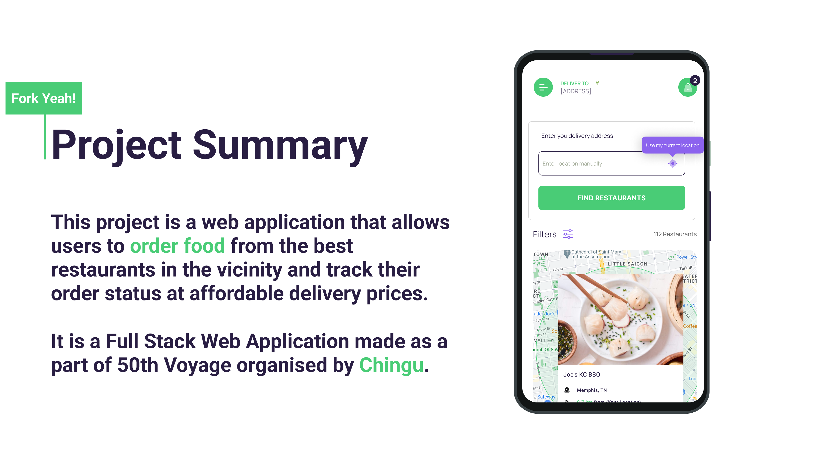
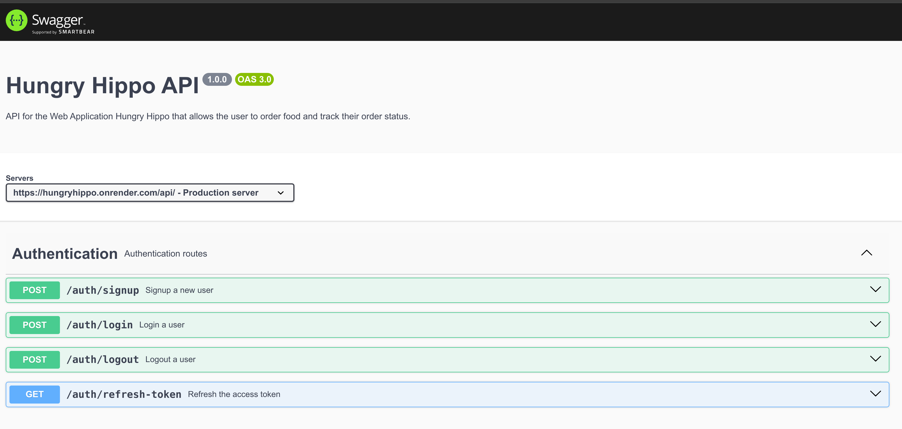

# Hungry Hippo


[Link to the Hungry Hippo website](https://hungryhippo-tgrams.onrender.com/)


## Introduction


**Frontend**: React, Tailwind, TypeScript
**Backend**: NodeJS, Express, PostgreSQL, JavaScript|

T-grams Development Team presents the [Hungry Hippo](https://hungryhippo-tgrams.onrender.com/) project. This project is a web application that allows users to order food from the best restaurants in the vicinity and track their order status at affordable delivery prices.
It is a Full Stack Web Application made as a part of 50th Voyage organised by [Chingu](https://www.chingu.io/). More about Voyage 50 and the project requirements can be found:
  - [Chingu: Voyage Guide](https://github.com/chingu-voyages/Handbook/blob/main/docs/guides/voyage/voyage.md)
  - [Chingu: Voyage 50 - Tier 3 Project Requirements and Specifications](https://github.com/chingu-voyages/voyage-project-tier3-restaurantsim)

## Project Details


In order not to block the creative and innovative work of the project, the team has adopted the idea to use the Google Docs document as a team document in a very free fashion. We were sharing the ideas, adding details and minutes of the meetings in that document that was more of a brainstorming tool. The said document is accessible in the [Google Docs](https://docs.google.com/document/d/15vURBkOasLmq5THwEN9E6Dexm1B_NtrjHpaKKm70jZI).


### Design and Prototyping

The main design and prototyping is done by `Figma` and the file can be accessed [here](https://www.figma.com/design/jO2jiYuSf1iA3Eh3d0gbgb/Hungry-Hippo?node-id=1-172&t=0XKynAkPYrcUWODA-0).

On the other hand, some excerps are exported to the `docs` folder in `pdf` format.

- [Project Summary](./docs/wireframes/ProjectSummary.png)
- [Components](./docs/wireframes/components.pdf)
- [Overall Website Design](./docs/wireframes/website.pdf)


### Features

- TODO: Frontend guys fill this out :)


### API

***API Endpoints***

To access the API endpoints, you can use the following URLs:

- local URL: `http://localhost:3000/api`
- deployed URL: `https://hungryhippo.onrender.com/api`

SwaggerUI Documentation can be found [here](https://hungryhippo.onrender.com/api/docs)



<details>
<summary><strong>Authentication</strong></summary>

- Signup: /auth/signup` - <font style="color:green">POST</font> - raw/json data
  ```json
  {
    "username": "testuser",
    "email": "3JFJt@example.com",
    "password": "testpassword",
    "confirmPassword": "testpassword",
    *"firstName": "test",*
    *"lastName": "test",*
    *"contact": "1234567890"*
  }
- Login: `/auth/login` - <font style="color:green">POST</font> - raw/json data
  ```json
  {
    "username": "testuser", // or "email": "3JFJt@example.com"
    "password": "testpassword"
  }
- Logout: `/auth/logout` - <font style="color:green">POST</font>
- Refresh Token: `/api/auth/refresh-token` - <font style="color:red">GET</font>
</details>

<details>
<summary><strong>Reset Password</strong></summary>

- Reset Password email: `/resetpassword/send-password-reset-email` - <font style="color:green">POST</font> - raw/json data
  ```json
  {
    "email": "john.doe@example.com"
  }
- Reset link: `/resetpassword/reset-link/{token}` - <font style="color:red">GET</font>
  - it will redirect to the reset password page
- Reset Password: `/resetpassword/reset-password` - <font style="color:green">POST</font> - raw/json data
  ```json
  {
  "password": "newpassword123",
  "confirmPassword": "newpassword123"
    }
</details>

<details>
<summary><strong>Profile</strong></summary>

- Profile: `/api/auth/profile` - <font style="color:red">GET</font>
  **Food Items Search**
- Get All: `/api/fooditems/items` - <font style="color:red">GET</font> - raw/json data
  ```json
  {
  "password": "newpassword123",
  "confirmPassword": "newpassword123"
  }
- Update Profile: `/api/profile` - <font style="color:green">PUT</font> - raw/json data
  ```json
  {
  "username": "johndoe",
  "email": "johndoe@example.com",
  "firstName": "John",
  "lastName": "Doe"
  }
</details>

<details>
<summary><strong>Restaurants</strong></summary>

- Get all Nearby Restaurants (5km distance): `/api/nearbyrestaurants` - <font style="color:red">GET</font>
  ```json
  {
  "longitude": 40.6782,
  "latitude": -73.9442
  }
</details>

<details>
<summary><strong>Orders</strong></summary>

- Create Order: `/order/create-order` - <font style="color:green">POST</font> - raw/json data
  ```json 
  {
  "deliveryAddress": "whatever4",
  "deliveryDate": "2024-08-05",
  "deliveryTime": "14:00",
  "foodItems": [
    {
      "itemId": "1",
      "quantity": 1
    },
    {
      "itemId": 200,
      "quantity": 5
    },
    {
      "itemId": 4,
      "quantity": 2
    }
    ]
  }

- Get Order by Id: `/order/get-order/{orderId}` - <font style="color:red">GET</font>

- Get Orders by User: `/order/get-orders` - <font style="color:red">GET</font>

- Cancel Order: `/order/cancel/{orderId}` - <font style="color:green">PUT</font> - raw/json data
</details>

<details>
<summary><strong>Food Categories</strong></summary>

- Get all Food Categories: `/foodcategories` - <font style="color:red">GET</font>
</details>

<details>
<summary><strong>Food Items</strong></summary>

- Get Food Items: `?[foodItemId={id}&][categoryId={id}&][restaurantId={id}&country={country string}]` - <font style="color:red">GET</font>

</details>

<details>
<summary><strong>Wallet</strong></summary>

- Request Account Topup: `/wallets/requestAccountTopup` - <font style="color:green">POST</font> - raw/json data
  ```json {
    "amount": 50
  }
- Make Payment: `/wallets/makePayment` - <font style="color:green">POST</font> - raw/json data
  ```json {
    "amount": 30,
    "orderId": "order_123456"
  }
- Get Account Details: `/wallets` - <font style="color:red">GET</font>
</details>

<details>
<summary><strong>Transactions</strong></summary>

- Get Transactions: `/transactions` - <font style="color:red">GET</font>
</details>

### Database
- It was decided to use [PostgreSQL](https://www.postgresql.org/) relational database for this project.

By analyzing the proposed food items API from the deployed API [https://menus-api.vercel.app/](https://menus-api.vercel.app/), we have noticed that only the general list of all food items was obtainable. On the other hand, the repo [free-food-menus-api](https://github.com/igdev116/free-food-menus-api) was lacking the geo-coordinates of the food items (restaurants) that were available on the deployed API. Therefore, instead of relying on the deployed API, we decided to make a seeder script that would populate the database with the output of the deployed API: [`backend/seeders/API2db.js`](backend/seeders/API2db.js).

<details>
<summary>Database Schema Design</summary>


</details>

## Deployment

## Testing

## Technologies Used
 
### Programming Languages
- [HTML](https://developer.mozilla.org/en-US/docs/Web/HTML) - Hypertext Markup Language
- [CSS](https://developer.mozilla.org/en-US/docs/Web/CSS) - Cascading Style Sheets
- [TypeScript](https://www.typescriptlang.org/) was used for frontend
- [JavaScript](https://developer.mozilla.org/en-US/docs/Web/JavaScript) was used for backend

### Dependencies and Technologies

*Frontend*:
  - [React](https://reactjs.org/) Frontend framework
  - [Tailwind](https://tailwindcss.com/) CSS framework
  - [Tailwind-merge](https://www.npmjs.com/package/tailwind-merge) - Tailwind utilities
  - [Vite](https://vitejs.dev/) - Tool for building frontend
  - [Axios](https://github.com/axios/axios) for http requests
  - [dotenv](https://www.npmjs.com/package/dotenv) for environment variables
  - [Tanstack](https://tanstack.com/) react query and devtools
  - [React-Map-GL](https://www.npmjs.com/package/react-map-gl) for interactive maps
  - [React-Map-GL-Geocoder](https://www.npmjs.com/package/react-map-gl-geocoder) for address search
  - [React-Toastify](https://www.npmjs.com/package/react-toastify) for displaying notifications
  - [React-Router](https://www.npmjs.com/package/react-router-dom) for declarative routing
  - [React-Hook-Form](https://www.npmjs.com/package/react-hook-form) for form validation
  - [Zod](https://www.npmjs.com/package/zod) for ts data declaration and validation
  - [clsx](https://www.npmjs.com/package/clsx) clsx for class list
  - [uuid](https://www.npmjs.com/package/uuid) - for the generation of unique ids
  - [Mapbox-GL](https://www.mapbox.com/mapbox-gl-js/) - a JavaScript library for maps
  - [geoJson](https://www.npmjs.com/package/geojson) - for creating, viewing, and sharing spatial data

*Backend*:
  - [NodeJS](https://nodejs.org/en/) runtime environment
  - [Express.js](https://expressjs.com/) web backend framework
  - [PostgreSQL](https://www.postgresql.org/) database client libraries:
    - [pg](https://www.npmjs.com/package/pg)
    - [pg-hstore](https://www.npmjs.com/package/pg-hstore)
  - [Cookie Parser](https://www.npmjs.com/package/cookie-parser)
  - [Cors](https://www.npmjs.com/package/cors) library for cross-origin resource sharing
  - [JWT](https://jwt.io/) - JSON Web Tokens
  - [Bcrypt](https://www.npmjs.com/package/bcrypt) password hashing library
  - [Nodemailer](https://nodemailer.com/) module for email sending
  - [Sequelize](https://sequelize.org/) - ORM (Object-Relational Mapping)
  - [dotenv](https://www.npmjs.com/package/dotenv) for environment variables
  - [EJS](https://www.npmjs.com/package/ejs) - Embedded JavaScript templating
  - [fs](https://nodejs.org/api/fs.html) and [path](https://nodejs.org/api/path.html) modules for file handling
  - [Swagger UI](https://swagger.io/) and [Swagger JSDoc](https://github.com/Surnet/swagger-jsdoc) for API documentation
  - [Jest](https://jestjs.io/) for testing
  - [Stripe](https://stripe.com/) for payment processing

### Tools

**Hosting Platforms**
- [Render](https://render.com/) - Hosting and Live App deployment
- [Neon](https://neon.tech/) - PostgreSQL database hosting
- [GitHub](https://github.com/) - Source Control hosting and Project management

**Development and Design Tools**
- [Postman](https://www.postman.com/) - API testing
- [Visual Studio Code](https://code.visualstudio.com/) - Develompent code editor
- [Microsoft Designer](https://www.microsoft.com/en-us/designer/) - UI design and prototyping
- [Figma](https://www.figma.com/) - for wireframing and prototyping
- [Lucidchart](https://www.lucidchart.com/) for DB design


## Team Documents

- TODO: Add contents of the Google Docs Team Document here


## Our Team: T-grams


- Martha Mwangi #1: [GitHub](https://github.com/marthamwangi) / [LinkedIn](https://linkedin.com/in/martymwangi)

- King Samuel #2: [GitHub](https://github.com/frugalcodes) / [LinkedIn](https://www.linkedin.com/in/samuel-igwe-031152226/)

- Greg Minezzi #3: [GitHub](https://github.com/minezzig) / [LinkedIn](https://linkedin.com/in/gregminezzi)

- Tomislav Dukez #4: [GitHub](https://github.com/tomdu3) / [LinkedIn](https://www.linkedin.com/in/tomislav-dukez-bb2349231/)

- Riry Nomenjanahary  #5: [GitHub](https://github.com/TiaDev7474) / [LinkedIn](https://linkedin.com/in/riry-nomenjanahary-a47a85264)

- Albert Ngodi  #6: [GitHub](https://github.com/ngodi) / [LinkedIn](https://linkedin.com/in/albertngodi)
